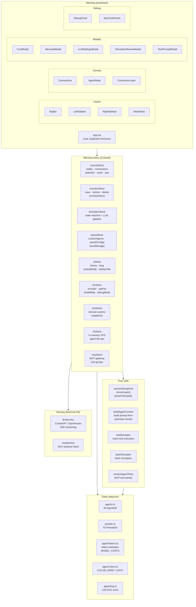
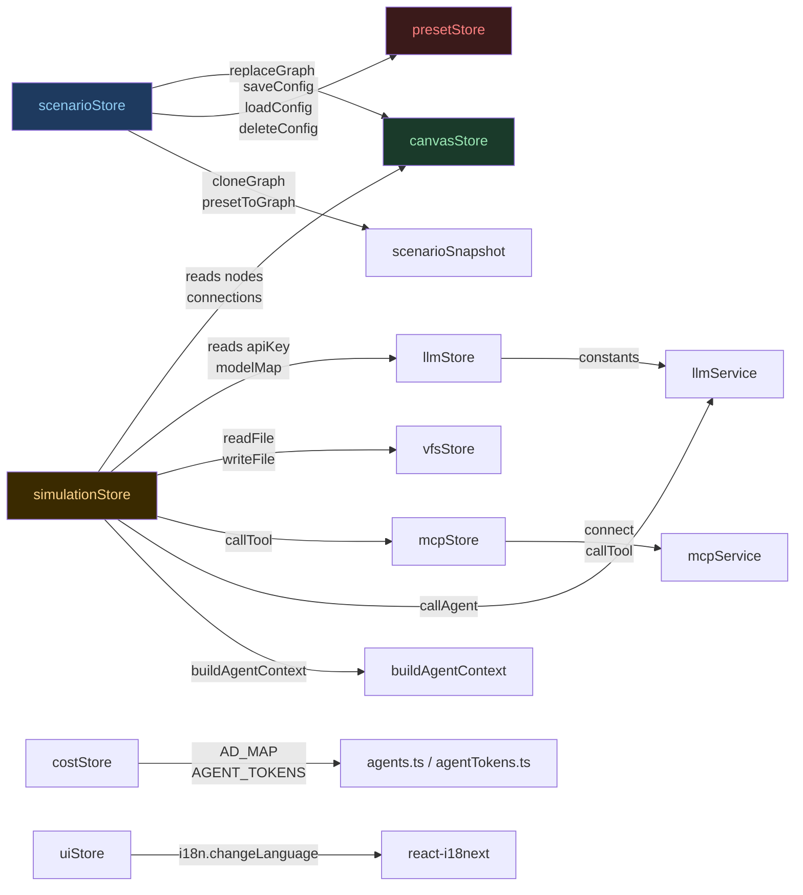
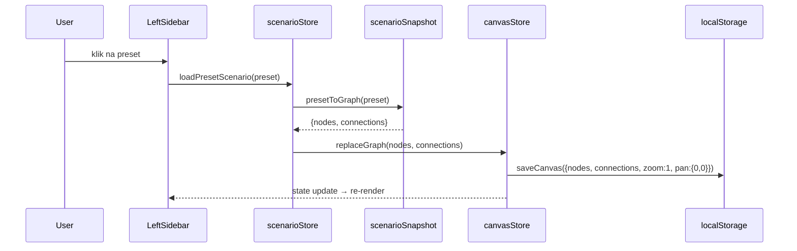
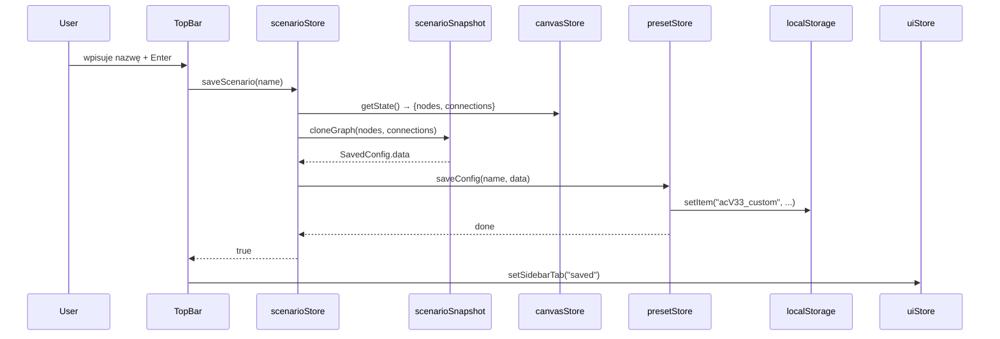
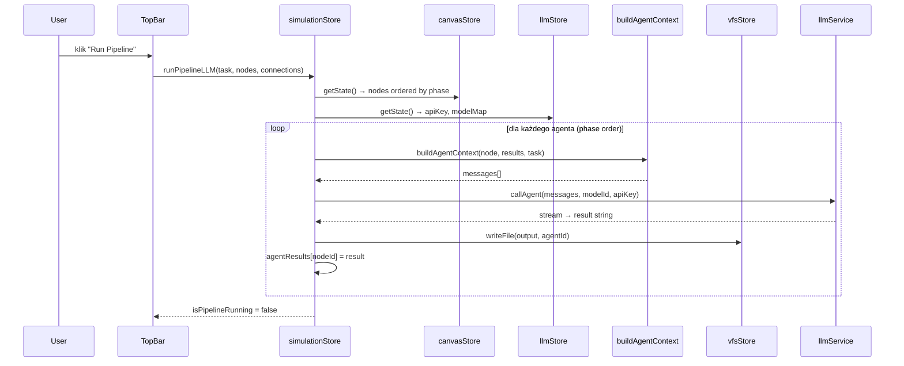

# Architecture — Agent Architecture Designer (v33)

> Opis czystości architektury, diagramy warstw, zależności między store'ami i kluczowe przepływy danych.

---

## 1. Warstwy aplikacji

---

## 2. Graf zależności między store'ami

> **Klucz**: `scenarioStore` jest jedynym wejściem do operacji na scenariuszach — nie wolno wywoływać `canvasStore.replaceGraph` bezpośrednio z komponentów.

---

## 3. Separacja odpowiedzialności store'ów

| Store | Odpowiedzialność | localStorage |
|---|---|---|
| `canvasStore` | Prymitywy edycji canvas (add/move/remove/select nodes) | `acCanvas` |
| `scenarioStore` | Orkiestracja scenariuszy (save/restore/delete) | — (deleguje do presetStore) |
| `presetStore` | Persystencja: custom agents + saved configs | `acV33_custom` |
| `simulationStore` | State machine symulacji + LLM pipeline executor | — |
| `uiStore` | Stan UI: motyw, język, aktywny modal, zakładka sidebar | `acV32_theme`, `acV32_lang` |
| `llmStore` | Konfiguracja LLM: provider, API key, model IDs | `acLLM` |
| `costStore` | Obliczenia kosztów/kontekstu (czysto funkcyjny, stateless) | — |
| `vfsStore` | Wirtualny system plików dla agentów podczas symulacji | — (in-memory) |
| `mcpStore` | Połączenie z zewnętrznym gateway MCP, grupy narzędzi | `acMcp` |

---

## 4. Przepływ: Wczytanie presetu → Canvas

---

## 5. Przepływ: Zapis scenariusza

---

## 6. Przepływ: Uruchomienie symulacji LLM

---

## 7. Ocena czystości architektury

| Kryterium | Ocena | Uwagi |
|---|---|---|
| Separacja warstw | ✅ PASS | Dane statyczne → Utils → Stores → Prezentacja |
| Jedna odpowiedzialność (SRP) | ✅ PASS | Każdy store ma jasno zdefiniowany zakres |
| Scenariusze odizolowane od edycji | ✅ PASS | `scenarioStore` jako jedyna bramka |
| Brak cykli zależności | ✅ PASS | Żaden store nie importuje komponentów |
| `canvasStore` bez logiki scenariuszy | ✅ PASS | `replaceGraph` to atomowe API granicy |
| `simulationStore` (God Store) | ⚠️ UWAGA | Łączy UI state (isRunning/step) z LLM pipeline executor — kandydat do podziału w przyszłości |
| Persystencja localStorage scentralizowana | ✅ PASS | `canvasStore` + `presetStore` + `llmStore` — każdy z własnym kluczem |
| Czyste funkcje testowalne | ✅ PASS | `scenarioSnapshot.ts`, `buildAgentContext.ts` — zero store deps |
| Bezpieczeństwo API keys | ✅ PASS | Klucze tylko w localStorage, nigdy proxy przez serwer |
