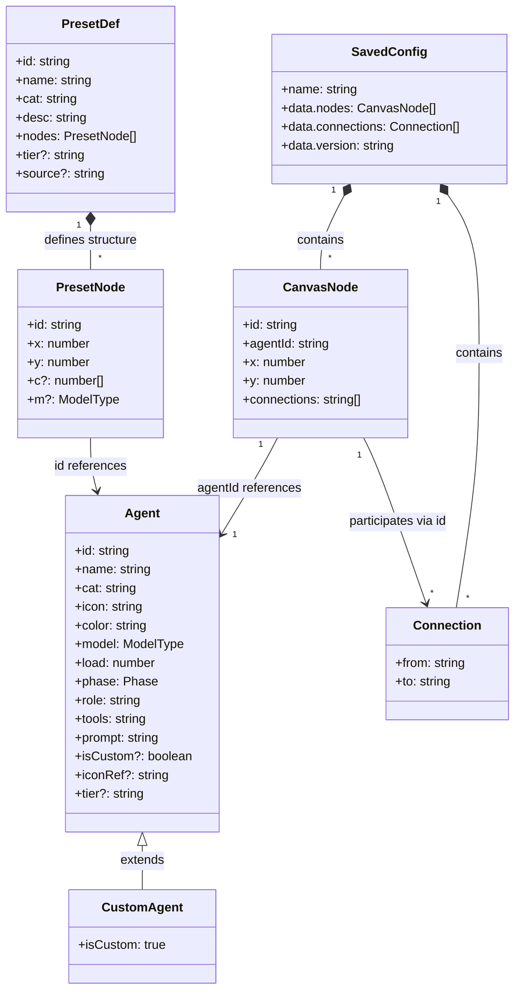
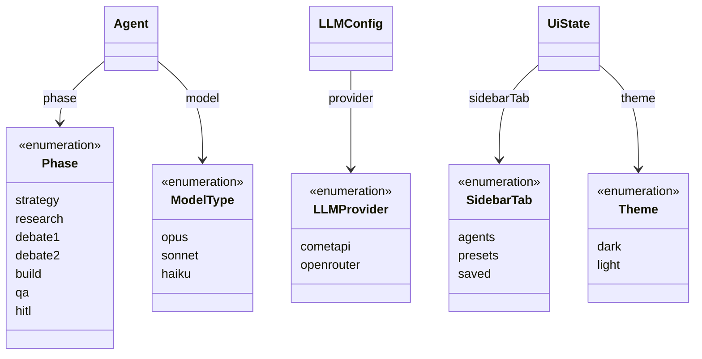
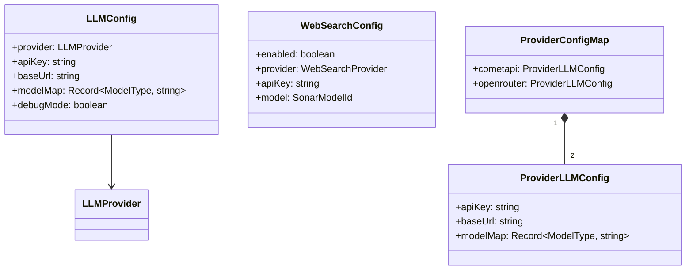
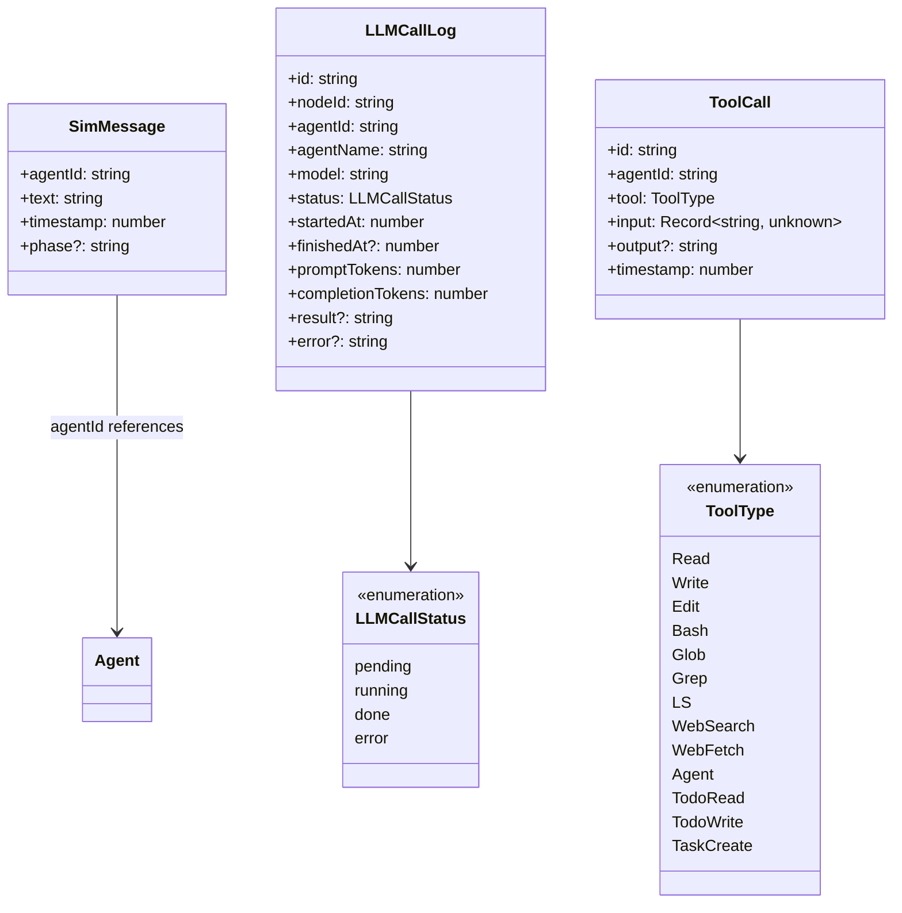
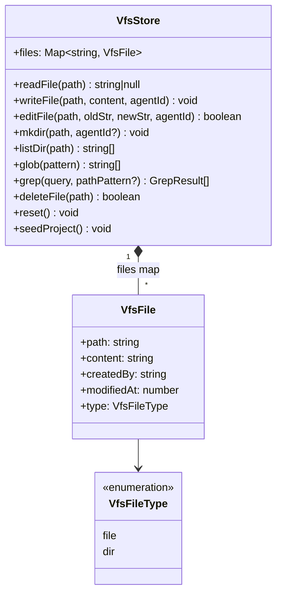
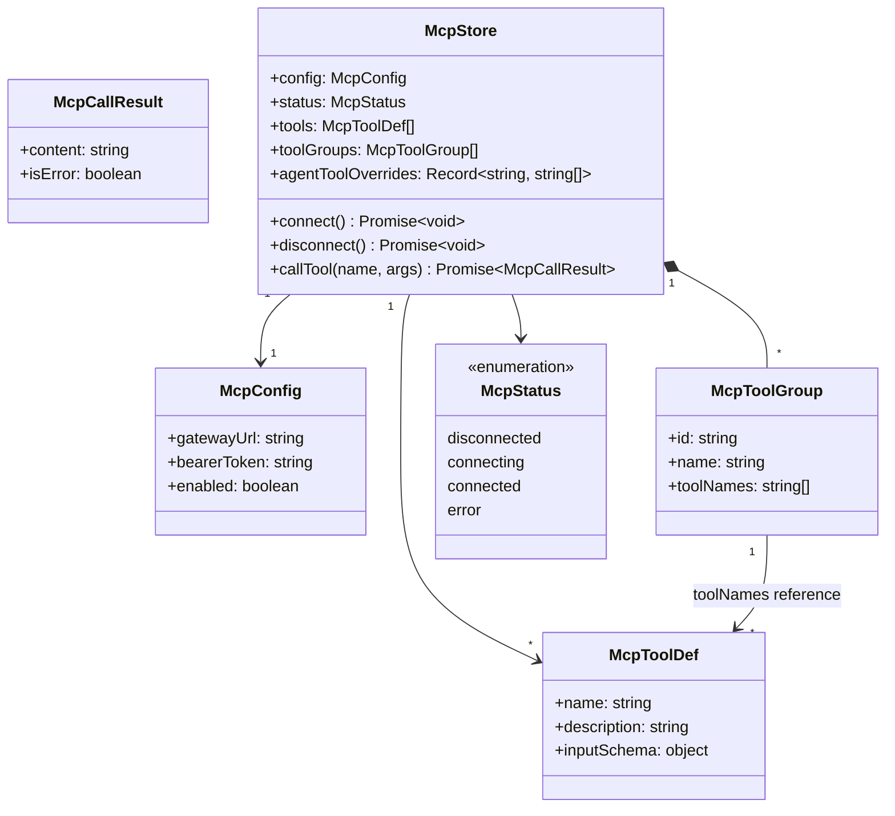
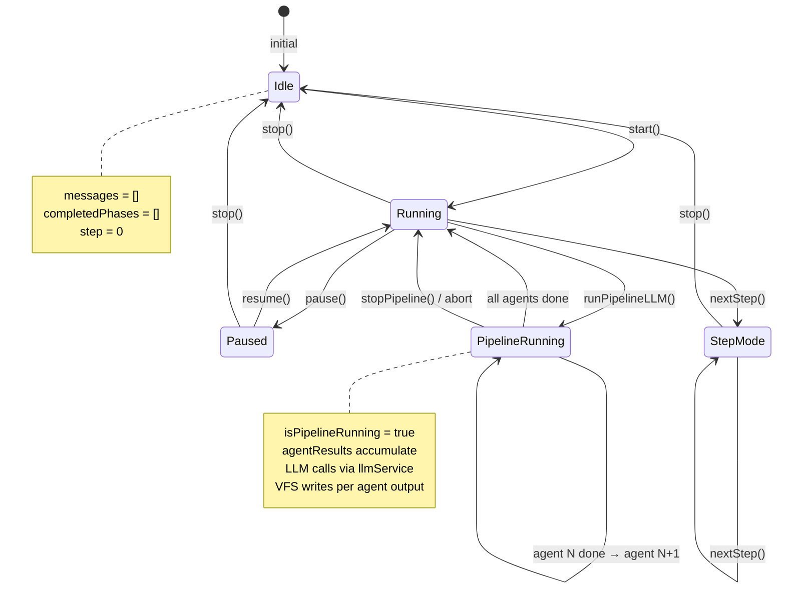
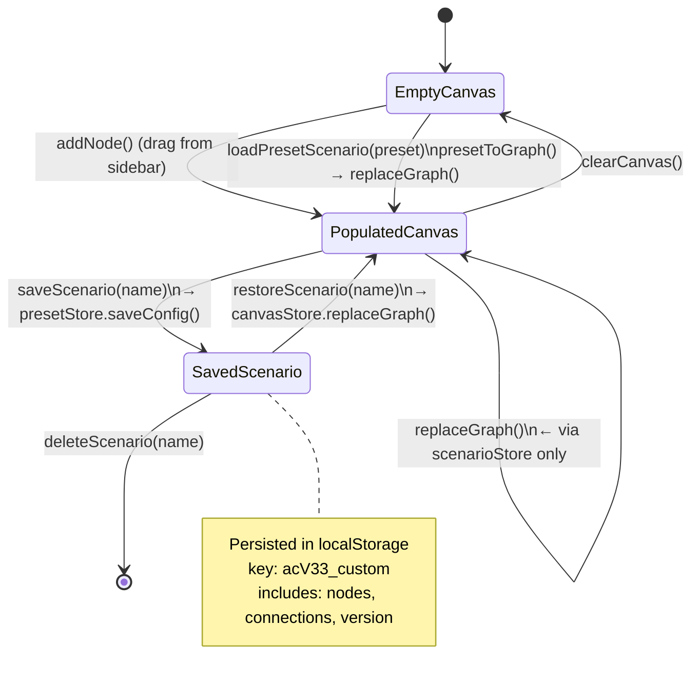
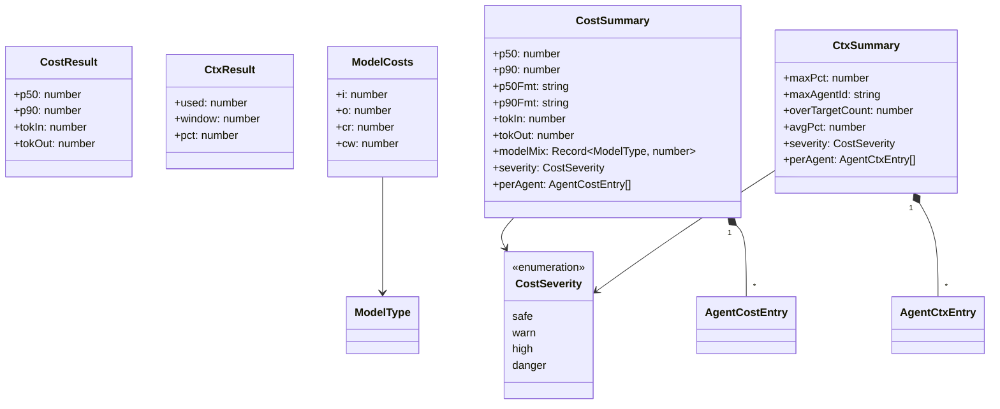
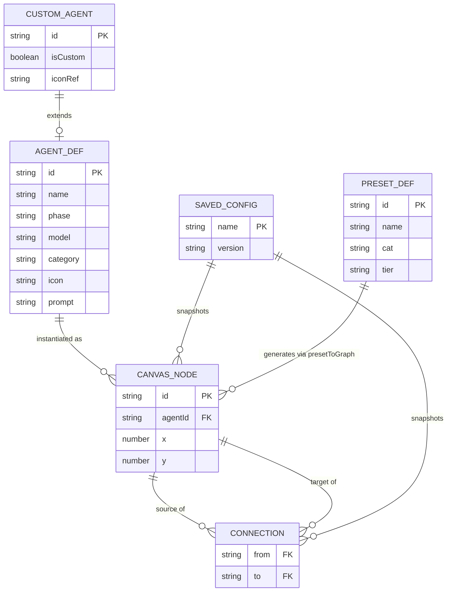

# Domain Model — Agent Architecture Designer (v33)

> Modele domenowe: encje, ich pola, relacje oraz maszyna stanów symulacji.

---

## 1. Model encji głównych

---

## 2. Typy wyliczeniowe (Enums)

---

## 3. Model konfiguracji LLM

---

## 4. Model symulacji i logów LLM

---

## 5. Model wirtualnego systemu plików (VFS)

---

## 6. Model MCP (Model Context Protocol)

---

## 7. Maszyna stanów symulacji

---

## 8. Cykl życia scenariusza

---

## 9. Model kosztów i kontekstu

---

## 10. Powiązania między warstwami danych a domeną

